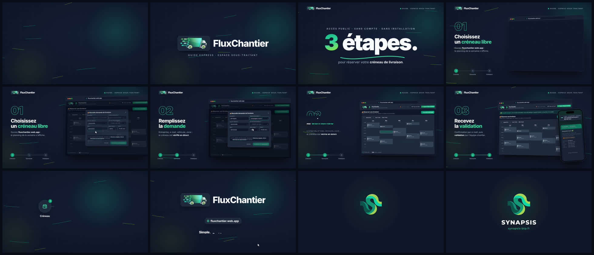

# Motion design FluxChantier : guide de la partie publique (15 s + signature Synapsis)



**Vidéo finale :** [`out/fluxchantier_motion.mp4`](out/fluxchantier_motion.mp4)
(1920×1080, 60 i/s, H.264 + AAC, 18,75 s, environ 6,9 Mo) : le guide de 15 s, suivi de 3,75 s de signature Synapsis.

Scénario, script, principes de mouvement et sound design : voir [`SCENARIO.md`](SCENARIO.md).

## Le parcours expliqué (Espace Sous-traitant, sans compte)

1. **Choisissez un créneau libre** : ouvrez *fluxchantier.web.app*, le planning de la semaine s'affiche.
2. **Remplissez la demande** : entreprise, e-mail, véhicule, zone. Le créneau est vérifié en direct, puis « Confirmer la réservation ».
3. **Recevez la validation** : un e-mail de confirmation, puis la validation par l'équipe chantier.

Le parcours, les écrans, la police Inter et le logo camion viennent du site réel. L'habillage suit la
charte **Synapsis-BTP** en thème sombre : fonds `#0F172A`, cartes `#1E293B`, actions `#059669` → `#10B981`,
accents `#34D399` / `#A3E635`. Le détail est dans [`SCENARIO.md`](SCENARIO.md).

## Comment c'est fabriqué

Tout est du code, donc modifiable et reproductible. Aucune vidéo ni image de banque n'est utilisée.

| Fichier | Rôle |
|---|---|
| `src/index.html` | Décor et reproduction des écrans du site. Les **variables de la charte** sont dans `:root`. |
| `src/anim.js` | Moteur d'animation : `seek(t)` place chaque élément à l'instant `t` (courbes d'accélération, images clés, caméra 3D, curseur). |
| `src/timeline.js` | Instants clés partagés par l'image **et** le son (clics, frappes, impacts…). |
| `scripts/render.mjs` | Capture image par image avec Chromium headless (Playwright), en parallèle. |
| `scripts/audio.py` | Synthèse de la musique (128 BPM) et des bruitages (numpy). |
| `scripts/build.sh` | Enchaîne tout : son → images → MP4, plus l'affiche et le storyboard. |

### Régénérer la vidéo

```bash
npm install            # playwright
pip install numpy
npm run build          # -> out/fluxchantier_motion.mp4
```

- Aperçu en temps réel dans le navigateur : `npm run preview`, puis ouvrir http://localhost:8080
  (`?t=7.5` fige l'image à 7,5 s).
- Images fixes de contrôle : `npm run stills -- 2.5,7.5,14.6` (enregistrées dans `build/stills/`).
- Re-rendu partiel : `FROM=12 TO=13.5 node scripts/render.mjs`, puis `SKIP_FRAMES=1 npm run build`.

### Modifier la charte ou les écrans

- couleurs : variables CSS `:root` de `src/index.html` (`--bg`, `--card`, `--line`, `--grad`, `--mint`, `--lime`, `--title`, `--muted`) ;
- logos : `src/img/` (camion `Logo_FluxChantier_Synapsis` recadré, symbole Synapsis détouré) ;
- police : `src/fonts/inter-latin-var.woff2` (fichier servi par le site) ;
- écrans et textes : le balisage de `src/index.html` (`#pageA` pour le planning, `#overlay` pour le formulaire, `#phone` pour les e-mails).
